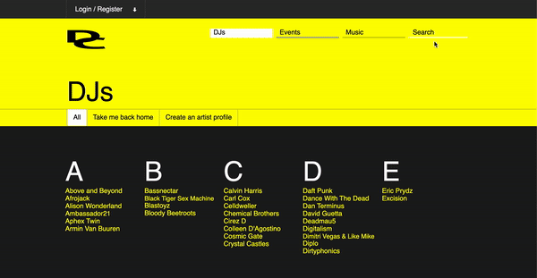

# Denizen Confidant
A one-stop shop for all things electronic music!

[Denizen Confidant](https://denizen-confidant.herokuapp.com/?#/)


# Features
* User Authentication: Users can sign up, log in and out, or log in as a demo user.


* Search Functionality: Users can type in a DJ, Genre or Event name in the search bar, and navigate to that show page through the generated link. Each letter typed will update the search dropdown with narrowed-down results.


  
  Process:
  
  I setup my state -- each entity starts off as an empty array, and the searchTerm (key piece of the operation) as an empty string:
  
  ```Javascript
   this.state = {
      djs: [],
      genres: [],
      events: [],
      searchTerm: ''
    }
    this.editSearchTerm = this.editSearchTerm.bind(this);
    this.djSearch = this.djSearch.bind(this);
  ```
  The two bound methods will do much of the heavy lifting. Here is the method for handling and updating user input:
  
  ```Javascript
  editSearchTerm(e) {
    this.setState({searchTerm: e.target.value})
  }
  ```
  
  After importing entities, mapping state and dispatch to props for each and setting the state of each entity within the Search Component (via componentDidMount), I created a filtering mechanism through which all the entities matching the current search term will be displayed:
    
  ```Javascript
     djSearch() {
      return this.state.djs.filter(dj => dj.name.toLowerCase().startsWith(this.state.searchTerm.toLowerCase())); 
     }
  ```
  Next, I create a query container component (displays all results for a given entity) and a query item component:
  
  ```Javascript
  class DjQueryContainer extends React.Component {
  render() {
    return (
      <div id="dj-query-container">
        {this.props.djs.map(dj => <DjQuery dj= {dj}/>)}
      </div>
    )
  }
}
class DjQuery extends React.Component {
  render() {
    return (
      <Link to={`/djs/${this.props.dj.id}`}>
        <div className="query-item" id="dj-query-item">
          <strong>{this.props.dj.name}</strong> <small>DJ</small>
        </div>
      </Link >
    )
  }
}
  ```
  
  Once I've created a query container and query item for each entity, I'm ready to attach these components to the search bar:
  
  ```Javascript
         <div id="searchbar" >
          <input type="text" id="search-input" 
            value={this.state.searchTerm}
            onChange={this.editSearchTerm}
            placeholder="DJs, Genres, Events"
          />
          <div id="search-button-container">
            <button id="search-button">Submit</button>
          </div>
          <div
          style={this.state.searchTerm.length ? { display: 'block' } : { display: 'none' }}
          >
          { this.state.searchTerm.length &&
            <ul id="searchlist">
            <li><DjQueryContainer djs = {this.djSearch()}/></li>
            <li><GenreQueryContainer genres = {this.genreSearch()}/></li>
            <li><EventQueryContainer events = {this.eventSearch()}/></li>
          </ul>
          }
          </div>
        </div>
  ```
  I put all three query containers into an unordered list, to facilitate in keeping the different entities organized and nicely stacked on top of eachother. 
  This list will only render on the condition that there is at least one character in the inputted search term i.e. when the search has begun.
 
  
* DJs: 100 DJs in the database, each with their own Show Page (w/ dynamic image & song rendering via Amazon Web Services). 


* Genres: Users can learn about many of the genres within Electronic Music. Genre show pages contain detailed overview + links to DJ show pages who are part of that genre.


* Events: List of some of the world's most popular Electronic Music events, each with their own show page.


## Frontend
* React.js
* Redux.js
* Javascript
* CSS/SCSS

## Backend
* Ruby on Rails
* PostgreSQL

## Hosting
* Heroku
* AWS (Amazon Web Services)


# Features to be implemented
* create an event for others to attend
* create artist profile
* upload music


* ...

